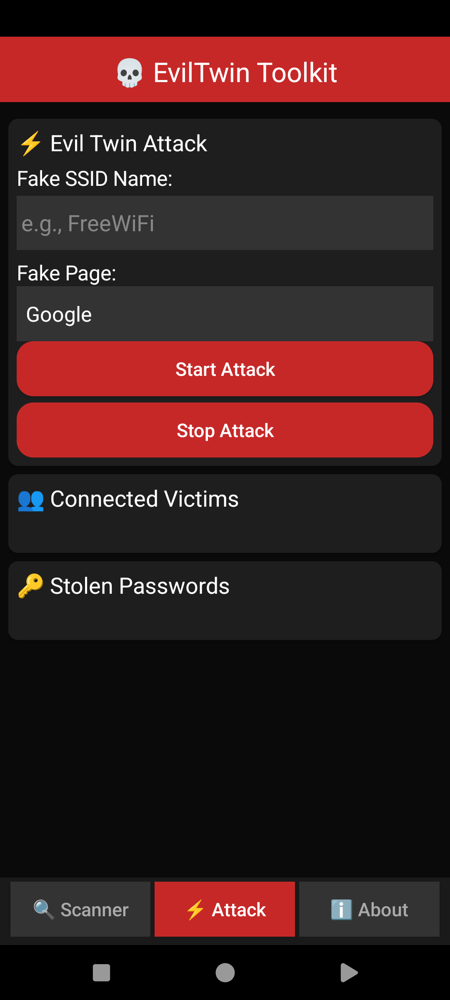
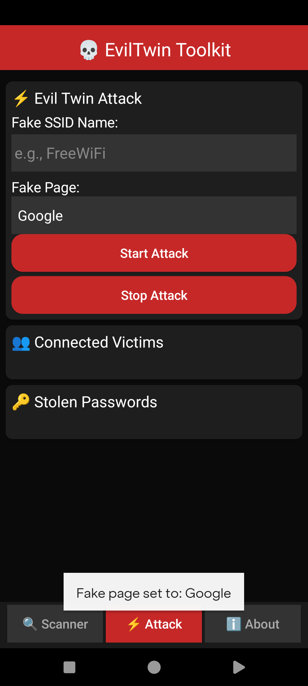

 # 💀 EvilTwin_Toolkit

An Android penetration testing tool for educational purposes. Combines WiFi scanning, Evil Twin detection, and phishing attacks with 10 realistic fake login pages.

> ⚠️ **DISCLAIMER:** This tool is strictly for educational purposes. Only use on devices and networks you own. The developer is not responsible for any misuse.

---

## 📸 Screenshots

  
  

---

## 🦈 What It Does

This tool simulates a real-world Evil Twin attack:

1. **Scanner** finds all nearby WiFi networks and detects if two networks share the same name (Evil Twin)
2. **Attack** starts a phishing server on your phone
3. When the victim opens your link, they see a realistic login page (Google, Instagram, etc.)
4. Their username and password are captured and stored in the app

---

## 📦 Installation

This repository includes the full Sketchware Pro project and a ready-to-install APK:

1. Download `EvilTwin Toolkit.apk` from the main directory
2. Install it on your Android device (you may need to enable **Install from Unknown Sources**)
3. Alternatively, import the project files from the `Project Sketchware App` folder into Sketchware Pro to build or modify the source code yourself

---

## 🔍 Scanner Features

- Scan all WiFi networks around you
- See each network's name (SSID)
- **Copy** all SSIDs with one click
- **Evil Twin Detection** - warns if duplicate SSIDs are found with different MAC addresses

---

## ⚡ Attack Features

- Built-in **10 phishing templates**:
  - Google, Instagram, Telegram, WhatsApp, Facebook
  - Twitter, Yahoo, Apple ID, Microsoft, Snapchat
- **Auto-detects** your local IP address
- Shows real-time connected victims
- Captures **username + password** from each victim
- **Save** all stolen credentials to a file
- Each phishing page looks like the real login page

---

## 🎨 UI Design

- **Dark theme** with red accents (hacker style)
- **3 tabs**: Scanner, Attack, About
- **Click animations** on all buttons
- **Scrollable** log views
- Professional card-based layout

---

## 📱 How To Use

### Setup
1. Make sure both phones are connected to the **same WiFi network**
2. Make sure **Location/GPS** is enabled on your phone
3. Grant **Location permission** when the app asks

### Scanning WiFi
1. Open the **Scanner** tab
2. Click **Start Scan**
3. Wait for results
4. Click **Copy All SSIDs** to copy network names

### Starting an Attack
1. Go to the **Attack** tab
2. Enter a **Fake SSID Name** (or paste one from Scanner)
3. Choose a **phishing page** from the dropdown (e.g., Instagram)
4. Click **Start Attack**
5. Note the link displayed (e.g., `http://192.168.1.5:8080`)

### On The Victim's Device
1. Open a web browser
2. Type the link shown on your phone
3. A realistic login page appears
4. Victim enters username and password
5. Credentials appear in **Stolen Passwords** on your phone

### After The Attack
- View all captured credentials in **Stolen Passwords**
- Click **Save Logs** to export them to a text file
- Click **Stop Attack** to end the phishing server

---

## 🧪 Testing Examples

### Test on Yourself
1. Start an attack
2. Open `localhost:8080` in your own browser
3. Enter test credentials
4. Check **Stolen Passwords** - they should appear

### Test with Two Phones
1. Connect both phones to the same WiFi
2. Start attack on **Phone A**
3. On **Phone B**, open the link from Phone A
4. Enter fake credentials on Phone B
5. They appear on Phone A's **Stolen Passwords**

### Detect Evil Twin
1. Go to **Scanner** tab
2. Click **Start Scan**
3. If two networks share the same name but have different MAC addresses, a warning appears

---

## 📋 Requirements

| Item | Detail |
|------|--------|
| Android | 6.0 or higher |
| Permissions | Location, WiFi, Network |
| Root | Not needed |
| Internet | Only for loading page images |

---

## 🔧 Troubleshooting

| Problem | Solution |
|---------|----------|
| White screen on launch | Force stop and reopen app |
| Scan shows no networks | Enable **Location/GPS** |
| Victim sees nothing | Check both devices are on same WiFi |
| Can't copy SSIDs | Try scanning again |
| Attack won't start | Fill in the SSID field first |

---

## 📁 Files

- `MainActivity.java` - Main UI and logic
- `HotspotWebServer.java` - HTTP phishing server
- `AndroidManifest.xml` - Permissions
- `Project Sketchware App/` - Full Sketchware Pro project for editing
- `EvilTwin Toolkit.apk` - Ready-to-install APK

---

## 👤 Developer

- **Age:** 18
- **Country:** Iran
- **GitHub:** [hellobytecodes](https://github.com/hellobytecodes)
- **Telegram:** [@MesterCore]
- **Email:** [hellobytecodes@gmail.com]

---

## 📜 License

MIT License - See [LICENSE](LICENSE) file for details.
